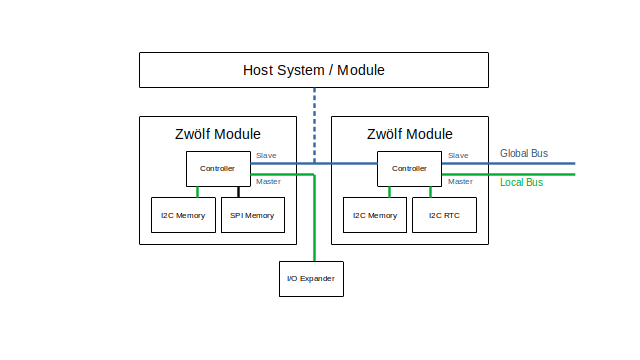

# Zwölf Microcontroller Platform

## Overview

Zwölf is a work-in-progress open microcontroller platform for simple embedded applications that require long-term data retention and/or long-term functionality.


This repo describes the abstract Zwölf MCU/CPU and will provide specifications and implementations for physical modules. **This project is under active development and is not entirely functional. Specifications are subject to change.**

While the modules are built with a variety of MCUs, FPGAs and memories from various vendors, each module is partially pin-compatible and implements the same code-compatible stack-based CPU and a common interface for control and programming.

See [this blog post](https://machdyne.com/2024/11/15/zwolf-mcu-platform/) for more details.

## Project Components

 * SOC - Zwölf implementation in Verilog (for FPGAs)
 * VM - Zwölf implementation in C (for Linux and MCUs)
 * Assembler (currently written in Python; will be ported to C)
 * Howl - Host software, firmware and remote control utilities
 * PCB layouts, schematics, symbols and footprints

## Specifications

### Physical

Zwölf modules are implemented as a versatile package that can be soldered surface mount, through-hole (DIP-12) or used as a removable module with a DIP socket, horizontal headers or spring contacts. The modules are also compatible with PMOD sockets.

#### Dimensions

| Dimension | Value |
| --------- | ----- |
| Length | 16mm max |
| Width | 13.5mm max |
| Height | 10mm max (including board) |
| Board Thickness | 0.8mm - 1.6mm |

#### Pinout

```
1  2  3  4  5  6
7  8  9  10 11 12
```

| Pin | GPIO | Primary Function | Alternative Function(s) |
|-----|------|------------------|-------------------------|
| 1 | A | Global I2C SCL (slave) | GPIO |
| 2 | B | Global I2C SDA (slave) | GPIO |
| 3 | C | Local I2C SCL (master) | GPIO / UART RX |
| 4 | D | Local I2C SDA (master) | GPIO / UART TX |
| 5 | - | GND | Ground |
| 6 | - | 3V3 | Power |
| 7 | E | module-specific | GPIO / USB\_PU / UART TX |
| 8 | F | module-specific | GPIO / USB\_DP |
| 9 | G | module-specific | GPIO / USB\_DN |
| 10 | H | module-specific | GPIO / INTN |
| 11 | - | RESETN | device reset (active low) |
| 12 | - | WPN | write protect (active low) |

### MCU

The MCU has at least 4 available GPIOs, which by default are configured as two I2C buses: a global (slave) and local (master) bus. On some implementations the default may be the only available configuration.



An optional host can communicate with the MCU(s) over the global bus, while the MCU can use the local bus for additional memory, I/O expanders, etc.

The global I2C bus is implemented by the MCU, but the local I2C bus is bit-banged from Zwölf user code.

#### Global Protocol

Devices respond to I2C address 0x00 and the I2C address register value, which can be set with the SIO instruction.

```
Write	<START> <ADDR> <W> [ACK] <REG> [ACK] <DATA> <ACK> <STOP> 
Read	<START> <ADDR> <R> [ACK] [DATA] [NACK] <STOP>
```

#### Programming

Programming is accomplished by setting the remote data register over the global I2C bus to a valid instruction and then setting the execute bit of the remote control register, after having previously set the halt bit.

You can use the SSP, LI/SH and PUSH instructions to enter a program into the program memory.

Finally, you can reset the MCU to run the program.

For example, to program a byte at a given address:

```
LI <addr_hi>	; load high address into a
SWAP			; put it in b
LI <addr_li>	; load low address into a
SSP				; set stack pointer to b:a
LI <data>		; load lower 7-bits into reg a
SH 				; set high bit if necessary
PUSH			; addr = a
```

There is a script that generates a list of Howl commands that use the method described above in order to load a program into a module:

```
$ python3 tools/b2h.py output/counter.bin > output/counter.asc
$ cat output/counter.asc > /dev/ttyACM0
```

### CPU

Addresses are 16-bits wide. Instructions and words are 8-bits wide.

#### Registers

| Name | Bits | Description |
|------|------|-------------|
| A | 8 | accumulator / low address |
| B | 8 | general purpose / high address |
| PC | 16 | program counter |
| SP | 16 | stack pointer |
| SR | 2 | status register (**z**ero, **f**low) |

#### Instructions

| Hex | Mnemonic | Description |
|-----|----------|-------------|
| 0x00 | NOP | no instruction (but clears SR) |
| 0x01 | PUSH | push reg a onto top of stack |
| 0x02 | POP | pop top of stack into reg a |
| 0x03 | CP | a = \*(sp + a) (copy stack item a into reg a) [aka dupn] |
| 0x04 | SWAP | swap values of reg a and reg b |
| 0x10 | ADD | a = a + b + SR:F |
| 0x11 | SUB | a = a - b - SR:F |
| 0x12 | AND | a = a & b |
| 0x13 | OR | a = a \| b |
| 0x14 | XOR | a = a ^ b |
| 0x15 | SH | a = a \| 0x80 (set high bit) |
| 0x20 | JP | pc = b:a |
| 0x21 | JZ | pc = b:a if SR:Z bit is set |
| 0x22 | JF | pc = b:a if SR:F bit is set |
| 0x30 | LPC | b:a = pc (load program counter; needed for function calls) |
| 0x32 | SSP | sp = b:a (set stack pointer; needed for remote programming) |
| 0x40 | LIO | a = io(b) (load io port value) |
| 0x41 | SIO | io(b) = a (store value to io port) |
| 0x80 | LI | load immediate lower 7 bits into reg a |

#### Memory Map

While the address space is 64KB the available memory depends on the implementation.

An example of an implementation with 8KB FRAM as main memory:

| Address | Description |
|---------|-------------|
| 0x0000 - 0x1dff | Program memory |
| 0x1e00 - 0x1fff | Stack memory |

#### I/O Map

| Register | Bit | R/W | Description |
|----------|-----|-----|-------------|
| 0x00 | | | system status and control register |
| | 7 | W | halt |
| | 6 | W | reset |
| | 5 | R | write protection enabled |
| | 4-1 | | reserved |
| | 0 | | GPIO mode for GPIOA/GPIOB |
| 0x10 | | RW | GPIO direction register |
| 0x11 | | RW | GPIO data register [H:A] |
| 0x7f | | RW | I2C address register |
| 0x80 | | W | remote control register |
| | 7 | W | halt (1) run (0) |
| | 6 | W | reset |
| | 5 | W | execute |
| | 4-0 | W | remote data register select (not implemented) |
| 0x81 | | RW | remote data register |

## License

The contents of this repo are released under the [Lone Dynamics Open License](LICENSE.md).

Note: You can use these designs for commercial purposes but we ask that instead of producing exact clones, that you either replace our trademarks and logos with your own or add your own next to ours.

